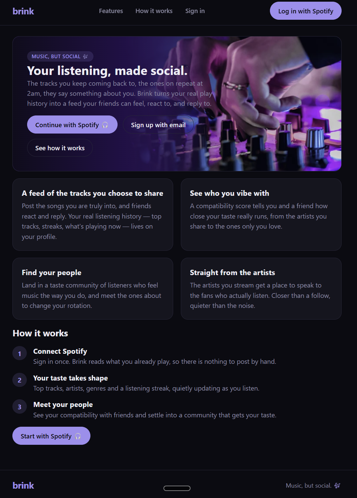
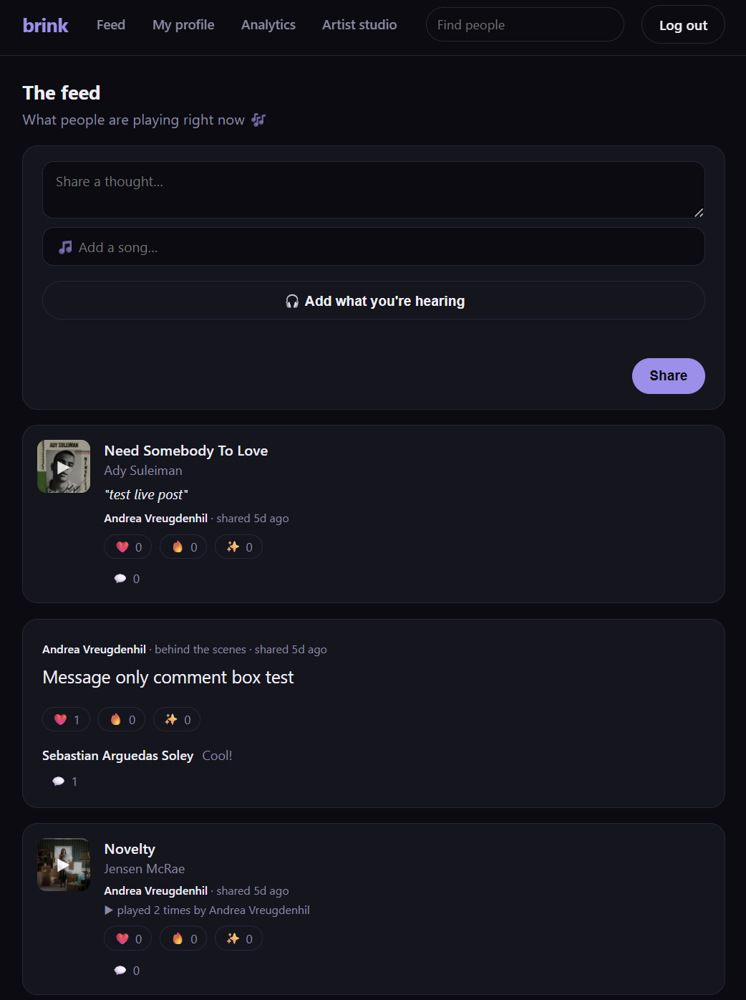
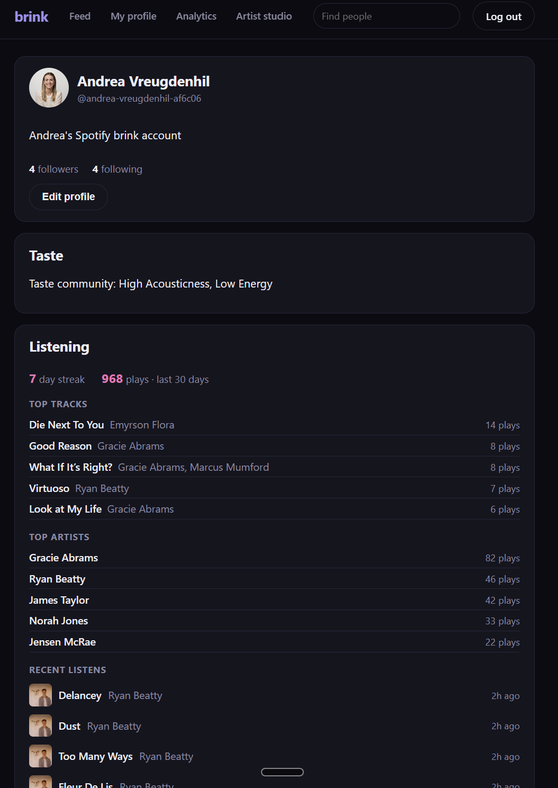
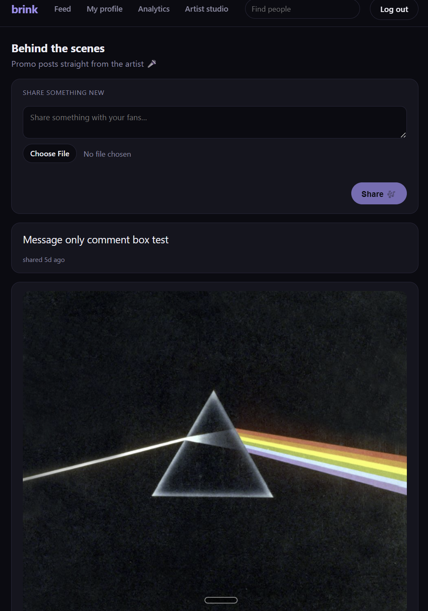
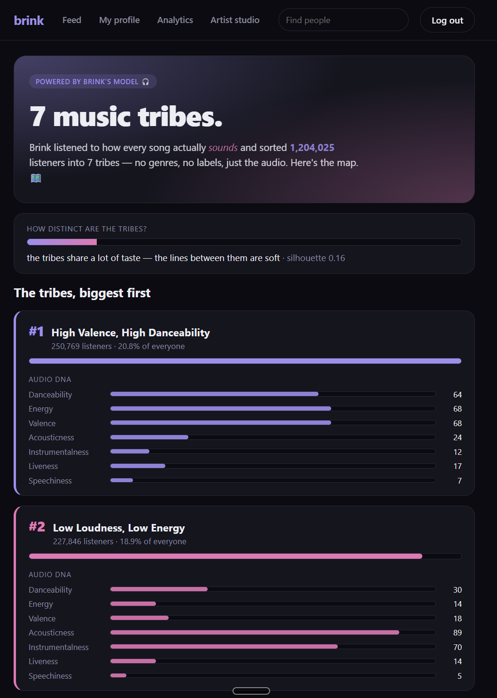

# Brink — Music, but social. 🎶

**Brink is a music-native social network built on your *real* listening.** Sign in with Spotify (or
email), and the tracks you choose to share become a feed your friends can play in place, react to,
and comment on. On top of that sits a machine-learning taste layer: every listener is placed in a
**taste community** (a cluster learned from ~1.2M tracks of audio features), and any two people get a
**compatibility score** for how similar their taste is. Artists get a lightweight portal to post
behind-the-scenes content to fans.

**🔗 Live app: https://brink-xg7p.onrender.com**

Built as the final project for McGill University's Desautels Faculty of Management (MMA) by a
three-person team.

**Team:** Andrea Vreugdenhil (backend · API · auth · DB) · Sebastian Arguedas Soley (frontend) ·
Jonah Walker (analytics / ML)

**Status:** feature-complete for the course scope — the full requirement catalog is delivered and
traced to tickets. (First-load may take ~50s while the free Render instance wakes.)

---

## What's inside

- **~40 JSON API endpoints** and **~14 data tables** across a `public` schema plus a
  bronze/silver/gold **medallion** analytics layout.
- **~320 backend tests** (`pytest`), run on every pull request.
- **Real, two-part machine learning:** batch **K-means** clustering (7 taste-community "personas"
  trained on a 1.2M-track Kaggle audio-feature set) plus **on-read inference** — a user's taste
  vector, nearest-cluster assignment, and cosine **compatibility** are all computed live at request
  time from a self-describing trained model artifact.
- **16 Architecture Decision Records**, **82 completed tickets** with full requirement→ticket
  traceability, and **5 GitHub Actions workflows** (tests + secret scan, a docs-sync gate, and three
  crons).

---

## Screenshots

**Landing** — sign in with Spotify or email; your listening becomes the feed.



**Feed** — songs play in place via a Spotify embed, with reactions, comments, and a "Liked by" line.



**Profile** — a Taste card (your taste community, and "% compatible" on others' profiles) plus a
listening summary.



**Artist studio** — behind-the-scenes posts for artist accounts.



**Analytics** — a Spotify-Wrapped-style read of the real model output: taste tribes, how distinct
they are, and each tribe's audio DNA.



---

## The pages

Brink is five server-rendered pages plus auth. All share one dark, "quietly premium" music-native
theme (near-black canvas, rounded cards, a lavender→pink accent gradient, Inter type, and friendly
emoji-tagged empty states).

| Page | URL | What it is |
|---|---|---|
| **Landing** | `/` | Public marketing page — hero, feature grid, and a 3-step "how it works." |
| **Feed** | `/feed` | The core surface. A composer (text and/or an attached song, or one-tap "share what you're hearing"), then post cards: songs **play in place** via a Spotify embed, show inline newest comments, a "Liked by X and N others" line, double-tap-to-heart, and a "played N times by the author" endorsement. Artist behind-the-scenes posts interleave in. |
| **Profile** | `/u/{handle}` | Avatar, bio, follower/following, and a **Taste card** — your taste community label, and (on someone else's profile) a "% compatible with your taste" line. Plus a listening summary: day streak, 30-day play count, top tracks/artists, recent listens. Editable on your own profile; one-tap "become an artist." |
| **Artist studio** | `/artist` | Behind-the-scenes uploads for artist accounts (image + caption, private signed-read storage), with an owner-only engagement summary. |
| **Analytics** | `/analytics` | A Spotify-Wrapped-style read of the **real** model output: how many taste tribes exist, how distinct they are (silhouette), a tribe leaderboard, and each tribe's "audio DNA." No hardcoded numbers — it reads the gold tables. |
| **Auth** | `/auth/*` | Spotify OAuth and email/password signup, confirmation, and login. |

---

## How it was built

Brink's engineering story is **disciplined, self-documenting governance chosen so a 3-person team
can own and defend a graded system** — including in security-critical code.

- **Decisions are logged before code.** Every architectural choice is an ADR in
  [`docs/decisions/adr/`](./docs/decisions/adr/). ADRs are append-only: to change a past decision we
  write a new ADR that supersedes the old one, so the log never goes stale. The two biggest moves are
  visible there — the backend pivoted from TypeScript/Vercel/Prisma to
  **[FastAPI/Render (ADR-0010)](./docs/decisions/adr/0010-fastapi-render-backend.md)**, and the
  frontend later moved from a React/Vite SPA to
  **[server-rendered Jinja pages (ADR-0013)](./docs/decisions/adr/0013-python-frontend.md)** — both
  driven by one principle: *the team must be able to read, review, and defend its own code.* The
  result is one Python codebase everyone can maintain.
- **Every change is a ticket and a pull request.** Work is scoped in
  [`docs/plans/tickets/`](./docs/plans/tickets/) (one file per ticket, organized into dependency
  waves) and traced back to a requirement catalog in
  [`docs/plans/requirements.md`](./docs/plans/requirements.md). One ticket = one PR into `develop`;
  `main` is production. Scope cuts are disclosed, not hidden (e.g. the second ML model was cut with a
  written [ADR-0016](./docs/decisions/adr/0016-cut-second-regression-model.md)).
- **CI enforces the norms.** [`.github/workflows/`](./.github/workflows/) runs the test suite and a
  secret scan on every PR, plus a **docs-sync gate** that fails a PR which changes code but not its
  docs — you can't merge stale documentation.

New here? [`CLAUDE.md`](./CLAUDE.md) is the full contributor & agent contract (commands, conventions,
hard rules, ownership).

---

## Architecture

```
Browser ──── same-origin HTML pages + /api/* JSON ────┐
                                                       ▼
              FastAPI app (Python, backend/, on Render)
                │  SQLModel + Alembic          │  Supabase Auth (server-side JWT validation)
                ▼                               ▼
        Supabase Postgres  ◀──────────  we own Spotify token refresh (AES-256-GCM at rest)
        (public + bronze/silver/gold schemas, Storage)
                ▲
                │  writes model output (gold tables)
   Analytics: Python / scikit-learn batch job (analytics/, nightly GitHub Actions cron)
```

- **One app, one host.** A single FastAPI/Python app on Render serves **both** the `/api/*` JSON
  endpoints and the server-rendered HTML pages (Jinja2 templates + progressive-enhancement
  JavaScript), same-origin — no CORS, no separate frontend build.
- **Supabase** provides Postgres, Auth, and Storage. The Data API is disabled; tables are reached
  only through the ORM. Auth validates the Supabase JWT server-side (no JWT secret held); we own
  long-term Spotify access via an encrypted stored refresh token.
- **`analytics/`** is a separate `uv`-managed Python pipeline that trains the K-means model nightly
  and writes results into the gold schema; the backend reads those results and does per-user
  inference on the fly.

Repo layout: **`backend/`** (the whole app — API + Jinja frontend), **`analytics/`** (the ML
pipeline), **`docs/`** (requirements, tickets, decision records).

---

## Running it locally

You need a root `.env` (git-ignored and shared separately — copy `.env.example` and ask Andrea for
the values). Local dev is **one terminal** — the FastAPI app serves both the API and the pages.

```bash
# API + HTML frontend on http://127.0.0.1:3001/  (/ for the pages, /api/* for the API)
cd backend && uv run uvicorn app.main:app --reload --port 3001
```

- **Test:** `cd backend && uv run pytest` (backend) · `cd analytics && uv run pytest` (analytics).
- **Migrations:** SQLModel + Alembic from `backend/` — see [`CLAUDE.md`](./CLAUDE.md) for the env-var
  list and migration details.

---

## Branching & deploying

- **`develop`** is the integration branch — every change goes through a PR into `develop`.
- **`main`** is production — **Render** deploys the whole app from `main`. `develop` reaches `main`
  only via a release PR. **Never push to `main` or `develop` directly.**
- Branch naming: `<type>/<ticket-id>-<slug>` (e.g. `feat/T10-posts-api`). One ticket = one PR.
- CI runs the backend + analytics tests, a secret scan, and the docs-sync gate on every PR.

## Contributing

1. Read [`CLAUDE.md`](./CLAUDE.md) and the relevant ticket in `docs/plans/`.
2. Branch off `develop`, write the test first, keep the change scoped to one ticket.
3. Open a PR into `develop`. Record architecture decisions as ADRs and keep docs in sync in the
   same PR.
